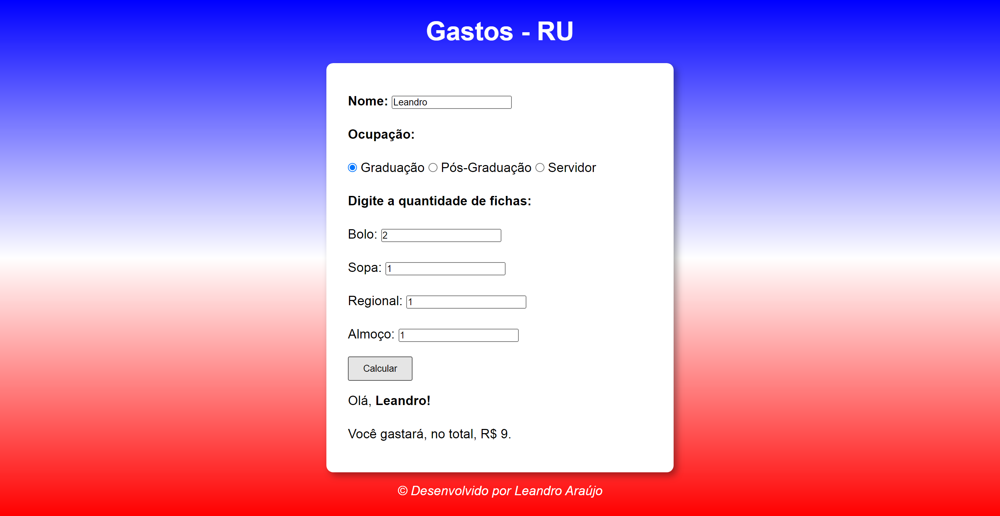

<h1 style="text-align: center; font-weight: bold;">Gastos-RU</h1>

## Demonstração 📸

  

---

## Sobre o Projeto

Programa que calcula os potenciais gastos do estudante no Restaurante Universitário da UFAL.
 
Obs: Dependendo da ocupação do aluno, ele pagará mais caro!

### 🛠 Tecnologias

As seguintes ferramentas foram usadas na construção do projeto:

- [HTML5]
- [CSS3]
- [Javascript]
---

 

Veja meu Linkedin: [LEANDRO ARAÚJO](http://www.linkedin.com/in/leandro-ara%C3%BAjo-da-silva-1660631b9)